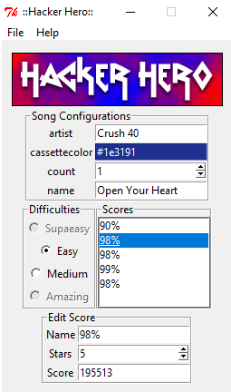

# Hacker Hero
A score editor for the game frets on fire

Made with python2 and tkinter.

<kbd></kbd>

## How to run:

Download binaries for windows
https://github.com/shuantsu/hacker_hero/releases

## Or...

Install miniconda

https://docs.conda.io/en/latest/miniconda.html

(Remember to have it on the PATH)

Create the environment

```
conda env create -f "environment.yml"
```

Then run with these commands:

```
conda activate 2019_12_31-hacker_hero
python main.py
```
